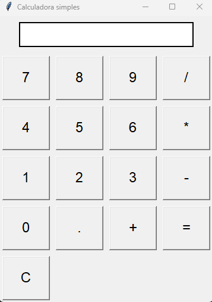

# 🧮 Calculadora Simples - Python & Tkinter

Projeto de uma **calculadora simples** com interface gráfica, desenvolvida com **Python** e a biblioteca **Tkinter**.

## 🚀 Funcionalidades

- Interface gráfica com botões numéricos
- Operações básicas: soma, subtração, multiplicação e divisão
- Tratamento de erros (exibição de "Erro" em caso de operação inválida)
- Layout organizado com **Grid** para os botões
- **Ícone personalizado** na janela

## 🛠️ Tecnologias

- **Python 3.x**
- **Tkinter** (GUI nativa do Python)
- **Pillow** (para manipulação do ícone)

## 📷 Imagem do projeto



## ▶️ Como executar

1. **Clone o repositório**:
   ```bash
   git clone https://github.com/seunome/calculadora-python.git

